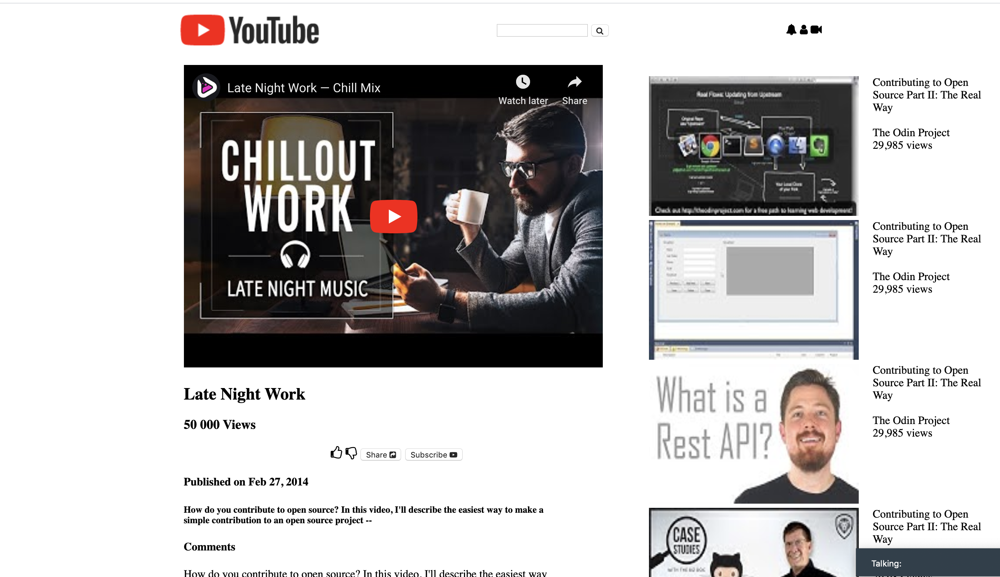

# Youtube-replica

> Re-creating a Youtube Page
> 

## Built With

- HTML &,
- CSS,

## Live Demo

[Live Demo Link](https://raw.githack.com/imahnama/Youtube-replica/Ikraam-Rahma-feature/index.html)

## Getting Started

To get a local copy up and running follow these simple example steps.

### Prerequisites

A browser of your choice preferrably Chrome.

### Setup

Fork this project to your local machine

### Deployment

Use Github pages

## Authors

👤 **Ikraam Ghoor**

- Github: [@ikraamg](https://github.com/ikraamg)
- Twitter: [@GhoorIkraam](https://twitter.com/GhoorIkraam)
- Linkedin: [isghoor](https://linkedin.com/isghoor)

👤 **Rahma Halane**

- Github: [@Imahnama](https://github.com/imahnama)
- Twitter: [@halane_rahma](https://twitter.com/halane_rahma)
- Linkedin: [Rahmahalane](https://linkedin.com/Rahmahalane)

## 🤝 Contributing

Contributions, issues and feature requests are welcome!

Feel free to check the [https://github.com/imahnama/Youtube-replica/issues](issues/).

## Show your support

Give a ⭐️ if you like this project!

## Acknowledgments

- Freecodecamp
- The Different Ways to Start Project using Floats, Flexbox, and Grid CSS by Ruben Paz Chuspe (https://hackernoon.com/the-different-ways-to-start-project-using-floats-flexbox-and-grid-css-4x82371n)

## 📝 License

No License
